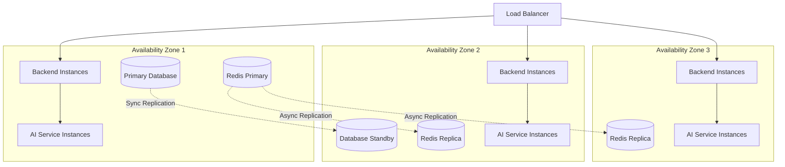
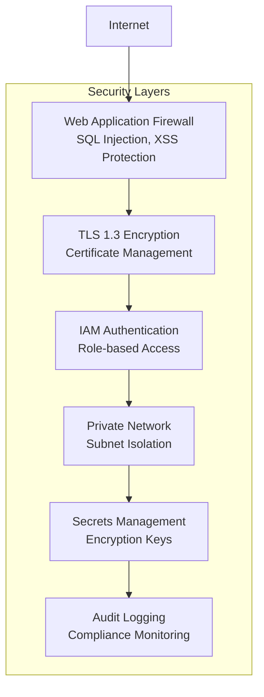

# Production Environment Architecture

This document describes the system architecture for the production environment of the Tax Assistant AI Review system.

## Overview

The production environment is designed for high availability, scalability, and security:
- **Frontend**: Multi-CDN deployment with global distribution
- **AI Backend**: Auto-scaling Django application cluster
- **AI Review Service**: Auto-scaling FastAPI application cluster
- **Ollama**: Dedicated, high-performance LLM inference cluster
- **Infrastructure**: Full SOC2 compliance with comprehensive monitoring

## Architecture Diagram

```mermaid
graph TB
    subgraph "Production Environment - High Availability"
        subgraph "CDN and Load Balancer Layer"
            CDN[Global CDN<br/>CloudFlare/AWS CloudFront]
            WAF[Web Application Firewall<br/>DDoS Protection]
            LB[Load Balancer<br/>AWS ALB/NGINX Plus<br/>Multi-AZ]
        end
        
        subgraph "Frontend Layer - Multi-Region"
            FE1[Frontend CDN Edge<br/>Region 1]
            FE2[Frontend CDN Edge<br/>Region 2]
            FE3[Frontend CDN Edge<br/>Region N]
        end
        
        subgraph "API Gateway Layer - Auto Scaling"
            ASG1[Auto Scaling Group 1]
            BE1[AI Backend 1<br/>Django + Gunicorn]
            BE2[AI Backend 2<br/>Django + Gunicorn]
            BE3[AI Backend N<br/>Django + Gunicorn]
            
            ASG1 -.-> BE1
            ASG1 -.-> BE2
            ASG1 -.-> BE3
        end
        
        subgraph "AI Processing Layer - Auto Scaling"
            ASG2[Auto Scaling Group 2]
            AI1[AI Review Service 1<br/>FastAPI + Uvicorn]
            AI2[AI Review Service 2<br/>FastAPI + Uvicorn]
            AI3[AI Review Service N<br/>FastAPI + Uvicorn]
            
            ASG2 -.-> AI1
            ASG2 -.-> AI2
            ASG2 -.-> AI3
        end
        
        subgraph "Dedicated LLM Cluster - High Performance"
            LB_OL[Ollama Load Balancer<br/>Internal LB]
            OL1[Ollama Instance 1<br/>GPU Optimized<br/>NVIDIA A100/H100]
            OL2[Ollama Instance 2<br/>GPU Optimized<br/>NVIDIA A100/H100]
            OL3[Ollama Instance N<br/>GPU Optimized<br/>NVIDIA A100/H100]
            
            LB_OL --> OL1
            LB_OL --> OL2
            LB_OL --> OL3
        end
        
        subgraph "Storage Layer - Multi-AZ"
            DB_PRIMARY[(Primary Database<br/>PostgreSQL RDS<br/>Multi-AZ)]
            DB_READ[(Read Replicas<br/>PostgreSQL RDS<br/>Multi-AZ)]
            CACHE_CLUSTER[(Redis Cluster<br/>ElastiCache<br/>Multi-AZ)]
            S3_PROD[(S3 Production<br/>Multi-Region<br/>Encryption)]
            S3_BACKUP[(S3 Backup<br/>Cross-Region<br/>Versioning)]
        end
        
        subgraph "Security Layer"
            VAULT[HashiCorp Vault<br/>Secrets Management]
            IAM[IAM Roles<br/>Least Privilege]
            KMS[AWS KMS<br/>Encryption Keys]
        end
        
        subgraph "Monitoring and Observability"
            METRICS[Prometheus + Grafana<br/>CloudWatch]
            LOGS[ELK Stack<br/>Log Aggregation]
            APM[Application Performance<br/>New Relic/DataDog]
            ALERTS[PagerDuty<br/>Alert Management]
        end
        
        subgraph "Backup and DR"
            BACKUP[Automated Backups<br/>Cross-Region]
            DR[Disaster Recovery<br/>Hot Standby]
        end
    end
    
    %% External Traffic Flow
    USERS[Global Users] -->|HTTPS| CDN
    CDN --> WAF
    WAF --> LB
    
    %% CDN Distribution
    CDN --> FE1
    CDN --> FE2  
    CDN --> FE3
    
    %% Load Balancer to Backend
    LB -->|Health Checked| BE1
    LB -->|Health Checked| BE2
    LB -->|Health Checked| BE3
    
    %% Backend to AI Services
    BE1 -->|Internal Network| AI1
    BE1 -->|Internal Network| AI2
    BE2 -->|Internal Network| AI1
    BE2 -->|Internal Network| AI3
    BE3 -->|Internal Network| AI2
    BE3 -->|Internal Network| AI3
    
    %% AI Services to Ollama Cluster
    AI1 -->|Load Balanced| LB_OL
    AI2 -->|Load Balanced| LB_OL
    AI3 -->|Load Balanced| LB_OL
    
    %% Storage Connections
    BE1 --> DB_PRIMARY
    BE2 --> DB_PRIMARY
    BE3 --> DB_PRIMARY
    BE1 --> DB_READ
    BE2 --> DB_READ
    BE3 --> DB_READ
    BE1 --> CACHE_CLUSTER
    BE2 --> CACHE_CLUSTER
    BE3 --> CACHE_CLUSTER
    BE1 --> S3_PROD
    BE2 --> S3_PROD
    BE3 --> S3_PROD
    
    %% Security Integration
    BE1 --> VAULT
    BE2 --> VAULT
    BE3 --> VAULT
    AI1 --> VAULT
    AI2 --> VAULT
    AI3 --> VAULT
    
    %% Monitoring Integration
    BE1 --> METRICS
    BE2 --> METRICS
    BE3 --> METRICS
    AI1 --> METRICS
    AI2 --> METRICS
    AI3 --> METRICS
    OL1 --> METRICS
    OL2 --> METRICS
    OL3 --> METRICS
    
    BE1 --> LOGS
    BE2 --> LOGS
    BE3 --> LOGS
    AI1 --> LOGS
    AI2 --> LOGS
    AI3 --> LOGS
    
    %% Backup Flow
    DB_PRIMARY --> BACKUP
    S3_PROD --> S3_BACKUP
    
    %% Styling
    classDef frontend fill:#e1f5fe
    classDef backend fill:#f3e5f5
    classDef ai fill:#e8f5e8
    classDef llm fill:#fff3e0
    classDef storage fill:#fce4ec
    classDef security fill:#f1f8e9
    classDef monitoring fill:#f0f4c3
    classDef infrastructure fill:#e8eaf6
    classDef cdn fill:#e3f2fd
    classDef backup fill:#fafafa
    
    class CDN,FE1,FE2,FE3 frontend
    class BE1,BE2,BE3 backend
    class AI1,AI2,AI3 ai
    class LB_OL,OL1,OL2,OL3 llm
    class DB_PRIMARY,DB_READ,CACHE_CLUSTER,S3_PROD,S3_BACKUP storage
    class VAULT,IAM,KMS security
    class METRICS,LOGS,APM,ALERTS monitoring
    class LB,WAF,ASG1,ASG2 infrastructure
    class CDN cdn
    class BACKUP,DR backup
```



## Component Details

### Global CDN and Security
- **Technology**: CloudFlare or AWS CloudFront
- **Features**: 
  - Global edge locations
  - DDoS protection
  - Web Application Firewall (WAF)
  - SSL/TLS termination
  - Cache optimization

### Load Balancer
- **Technology**: AWS Application Load Balancer or NGINX Plus
- **Features**:
  - Multi-AZ deployment
  - Health checking
  - SSL termination
  - Request routing
  - Auto-scaling integration

### AI Backend (Django) - Production Cluster
- **Technology**: Django + Gunicorn with auto-scaling
- **Scaling**: 3+ instances with auto-scaling (2-20 instances)
- **Features**:
  - Horizontal pod autoscaling
  - Rolling deployments
  - Health checks and readiness probes
  - Circuit breaker patterns

### AI Review Service (FastAPI) - Production Cluster
- **Technology**: FastAPI + Uvicorn with auto-scaling
- **Scaling**: 3+ instances with auto-scaling (2-15 instances)
- **Features**:
  - Request queuing and load balancing
  - Timeout management
  - Response caching
  - Model request optimization

### Dedicated Ollama Cluster
- **Technology**: Multiple Ollama instances with GPU acceleration
- **Hardware**: NVIDIA A100/H100 GPUs
- **Features**:
  - Internal load balancer
  - Model replication across instances
  - GPU memory optimization
  - Request batching

## High Availability Features

### Multi-AZ Deployment


## Environment Variables

```bash
# Production Security
ENVIRONMENT=production
DEBUG=false
SECRET_KEY_PATH=/vault/secrets/django-secret
DATABASE_PASSWORD_PATH=/vault/secrets/db-password

# Database (RDS Multi-AZ)
DATABASE_URL=postgresql://user@prod-db-cluster.amazonaws.com:5432/taxassistant_prod
DATABASE_READ_URL=postgresql://user@prod-db-read.amazonaws.com:5432/taxassistant_prod

# Redis Cluster
REDIS_CLUSTER_URL=rediss://prod-redis-cluster.cache.amazonaws.com:6380

# AI Service Configuration
OLLAMA_CLUSTER_URL=http://ollama-internal-lb:11434
DEFAULT_MODEL=mistral-prod
MAX_CONCURRENT_REQUESTS=100
REQUEST_TIMEOUT=60

# Security
VAULT_URL=https://vault.internal.company.com
KMS_KEY_ID=arn:aws:kms:us-east-1:account:key/key-id
```

## Security Architecture

### SOC2 Compliance Features
- **Encryption**: All data encrypted at rest and in transit
- **Access Control**: IAM roles with least privilege
- **Audit Logging**: All actions logged and immutable
- **Network Security**: VPC with private subnets
- **Secrets Management**: HashiCorp Vault integration

### Security Layers


## Monitoring and Alerting

### Key Performance Indicators (KPIs)
- **Availability**: 99.99% uptime SLA
- **Response Time**: < 500ms for 95th percentile
- **Error Rate**: < 0.1% for 4xx/5xx errors
- **AI Processing Time**: < 30s for complex queries

### Monitoring Stack
- **Metrics**: Prometheus + Grafana + CloudWatch
- **Logs**: ELK Stack (Elasticsearch, Logstash, Kibana)
- **APM**: New Relic or DataDog
- **Alerting**: PagerDuty integration

### Critical Alerts
- **Service Down**: Any service instance failure
- **High Latency**: Response time > 2s for 5 minutes
- **Error Rate**: Error rate > 1% for 5 minutes
- **Database**: Connection pool exhaustion
- **GPU Utilization**: Ollama GPU usage > 90%

## Disaster Recovery

### Backup Strategy
- **Database**: Automated daily backups with point-in-time recovery
- **Files**: S3 cross-region replication
- **Configuration**: Infrastructure as Code (Terraform)
- **Secrets**: Vault backup to separate region

### Recovery Objectives
- **RTO (Recovery Time Objective)**: 15 minutes
- **RPO (Recovery Point Objective)**: 5 minutes
- **Failover**: Automated failover to standby region

## Auto-Scaling Configuration

### Backend Services
```yaml
Auto Scaling Policy:
  Min Instances: 3
  Max Instances: 20
  Target CPU: 70%
  Target Memory: 80%
  Scale Out Cooldown: 300s
  Scale In Cooldown: 300s
```

### AI Services
```yaml
Auto Scaling Policy:
  Min Instances: 2
  Max Instances: 15
  Target CPU: 60%
  Target Queue Depth: 10
  Scale Out Cooldown: 180s
  Scale In Cooldown: 600s
```

## Cost Optimization

### Resource Management
- **Spot Instances**: Use for non-critical workloads
- **Reserved Instances**: Core infrastructure on reserved capacity
- **Auto-scaling**: Scale down during low-usage periods
- **GPU Optimization**: Efficient model loading and sharing

### Monitoring Costs
- **Budget Alerts**: Alert on 80% of monthly budget
- **Resource Tagging**: Detailed cost allocation
- **Usage Analytics**: Monitor per-feature costs

## Deployment Strategy

### Blue-Green Deployment
- **Zero Downtime**: Blue-green deployment pattern
- **Health Checks**: Comprehensive health validation
- **Rollback**: Automated rollback on failure
- **Traffic Shifting**: Gradual traffic migration

### CI/CD Pipeline
- **Security Scanning**: Vulnerability scanning in pipeline
- **Performance Testing**: Load testing before production
- **Compliance Checks**: SOC2 compliance validation
- **Approval Gates**: Manual approval for production releases